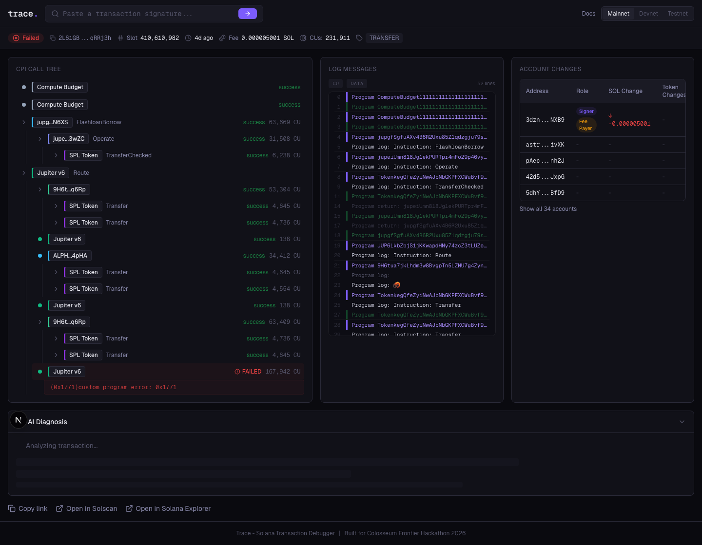

# Trace

**Debug any Solana transaction.**

Trace is a cloud-based Solana transaction debugging platform. Paste any transaction signature and get a visual CPI call tree, account state diffs, compute unit breakdown, and an AI-generated plain-English diagnosis of what broke and how to fix it.

Built for the [Colosseum Frontier Hackathon](https://www.colosseum.org/) (April 6 -- May 11, 2026).

---

## The Problem

When a Solana transaction fails, developers get cryptic error messages with no context. Anchor throws error codes. CPI failures show only the innermost failing instruction. Account state changes are invisible. There is no visual way to see what happened.

## The Solution

Trace reconstructs the full story of any transaction:

- **What programs were called** and in what order (CPI call tree)
- **What each one did** to account state (before/after diffs)
- **Where exactly it failed** and why (error code resolution)
- **How to fix it** (Claude AI diagnosis with code snippets)

## How It Works

```
Paste tx signature
       |
   Helius RPC (getTransaction + Enhanced API)
       |
   Log Parser --> CPI Tree Builder --> Account Diff Builder
       |                                       |
   Program Name Resolution (IDL + known map)   |
       |                                       |
   Assemble TraceTransaction <-----------------+
       |
   Claude AI Diagnosis (for failed txs)
       |
   Render: CPI tree | Logs | Account diffs | AI diagnosis
```

1. User pastes a transaction signature
2. Backend fetches the full transaction from Helius RPC
3. Log parser extracts structured data from raw log messages
4. CPI tree builder reconstructs the program call hierarchy from invoke depth markers
5. Account diff builder computes SOL and token balance changes
6. For failed transactions, Claude AI analyzes the trace and produces a one-sentence root cause, technical explanation, and suggested fix
7. Everything renders in a three-panel layout with the diagnosis below



---

## Features

- **CPI Call Tree** -- nested visualization of every program invoked, with color-coded program badges, status indicators, compute unit counts, and expand/collapse for log lines
- **Account Diff Table** -- before/after balances for SOL and tokens, with click-to-copy addresses and role badges (signer, fee payer, new account)
- **Log Stream** -- color-coded raw log messages with filtering for CU and data lines
- **AI Diagnosis** -- Claude-powered root cause analysis, error code decoding, and suggested fixes with code snippets. Auto-triggers on failed transactions.
- **27 Known Programs** -- Jupiter, Whirlpool, Raydium, Marinade, Jito, Tensor, Pyth, Metaplex, SPL Token, System Program, and more resolved to human-readable names
- **Network Support** -- mainnet, devnet, testnet with persistent selector
- **Shareable URLs** -- every trace has a permalink at `/tx/[signature]`
- **Explorer Links** -- one-click to Solscan and Solana Explorer
- **Mobile Responsive** -- tabbed layout on small screens
- **Redis Caching** -- transactions and diagnoses cached for 24 hours

---

## Tech Stack

| Layer | Technology |
|-------|-----------|
| Framework | Next.js 16 (App Router, React 19) |
| Language | TypeScript (strict mode) |
| Styling | Tailwind CSS v4, dark theme |
| Animation | Framer Motion |
| RPC | Helius (getTransaction + Enhanced API) |
| AI | Claude claude-sonnet-4-20250514 via Anthropic SDK |
| Cache | Upstash Redis (REST API) |
| Icons | Lucide React |
| Testing | Vitest (28 unit tests) |
| Hosting | Vercel |

---

## Getting Started

### Prerequisites

- Node.js 20+
- pnpm

### 1. Clone and install

```bash
git clone https://github.com/Jerome2332/trace.git
cd trace
pnpm install
```

### 2. Set up environment variables

```bash
cp .env.example .env.local
```

Fill in your API keys:

| Variable | Required | Source |
|----------|----------|--------|
| `HELIUS_API_KEY` | Yes | https://dev.helius.xyz |
| `ANTHROPIC_API_KEY` | Yes | https://console.anthropic.com |
| `UPSTASH_REDIS_REST_URL` | No | https://console.upstash.com |
| `UPSTASH_REDIS_REST_TOKEN` | No | https://console.upstash.com |

The app runs with just Helius + Anthropic. Redis adds caching but the app works without it.

### 3. Run locally

```bash
pnpm dev
```

Open http://localhost:3000 and paste a Solana transaction signature.

### 4. Run tests

```bash
pnpm test
```

---

## Project Structure

```
src/
  app/                    Next.js App Router
    api/
      transaction/        GET  - fetch + parse transaction
      diagnose/           POST - Claude AI diagnosis
      health/             GET  - uptime check
    tx/[signature]/       Transaction detail page
  components/
    cpi-tree/             CPI call tree visualization
    account-diff/         Account balance diff table
    logs/                 Log stream panel
    diagnosis/            AI diagnosis panel
    search/               Search bar + network selector
    transaction/          Status bar, loading, error states
    layout/               Header + footer
  lib/
    log-parser.ts         Core log parsing (7 regex patterns)
    cpi-tree-builder.ts   Depth-stack tree reconstruction
    account-diff-builder.ts  SOL + token balance diffs
    helius.ts             Helius RPC client
    diagnosis.ts          Claude prompt builder + API call
    idl-resolver.ts       Program name resolution
    known-programs.ts     19 hardcoded Solana program mappings
    anchor-errors.ts      Anchor error code lookup table
  types/                  TypeScript interfaces
  hooks/                  Client-side data fetching hooks
```

---

## Competitive Position

| Tool | What it does | What Trace does differently |
|------|-------------|---------------------------|
| Seer | Local IDE debugger | No web UI, requires source code, no AI |
| SolScan | Block explorer | Raw data, no CPI tree, no AI diagnosis |
| Helius Orb | Consumer tx explainer | Built for end users, not developers |
| Tenderly | EVM tx debugging | Solana not supported |
| **Trace** | **Cloud debugging platform** | **Visual CPI tree + AI diagnosis for any Solana tx** |

---

## Roadmap

- **v1.1** -- Anchor CLI plugin (`anchor test --trace`), transaction simulation
- **v1.2** -- Team workspaces, saved transaction collections
- **v2.0** -- Real-time monitoring, failure alerts, webhook integrations

---

## License

MIT
